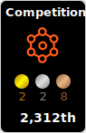

<h1 align="center">Hinako Mitsuoka 🍑</h1>
<h3 align="center">Studying Computer Vision and Pattern Recognition</h3>

  
  
  
  

<h2>Languages / Skills</h2>

<strong>Languages & Libraries</strong>

<strong>Tools & Environments</strong>

<h2>Education / Research / Competitions</h2>
<ul>
  <li>
    <strong>Master's Student (Computer Vision)</strong>: 2024/4 ~ Present
    <ul>
      <li>Focus: Pattern Recognition, Deep Learning</li>
      <li>Research on [あなたの具体的な研究テーマ]</li>
    </ul>
  </li>
  <li>
    <a href="#">Conference / Paper Submission</a>: 202X/XX
    <ul>
      <li>Title: "Your Paper Title Here"</li>
      <li>Role: First Author</li>
    </ul>
  </li>
  <li>
    Internship at <a href="#">Company Name</a>: 202X/XX ~ 202X/XX
    <ul>
      <li>Developed Image Processing Algorithm using Python</li>
    </ul>
  </li>
</ul>

<h2>Qualifications</h2>
<ul>
  <li>TOEIC L&R: 740 (2023)</li>
</ul>

<h2>Status</h2>

  

<picture>
  <source media="(prefers-color-scheme: dark)" srcset="https://raw.githubusercontent.com/ppppeach-jam/ppppeach-jam/output/github-contribution-grid-snake-dark.svg">
  <source media="(prefers-color-scheme: light)" srcset="https://raw.githubusercontent.com/ppppeach-jam/ppppeach-jam/output/github-contribution-grid-snake.svg">
  
</picture>

 

